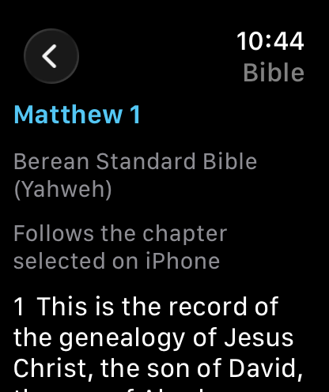
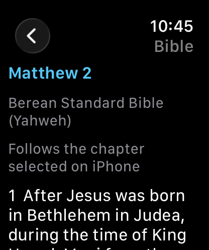
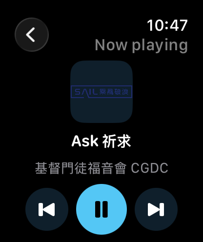
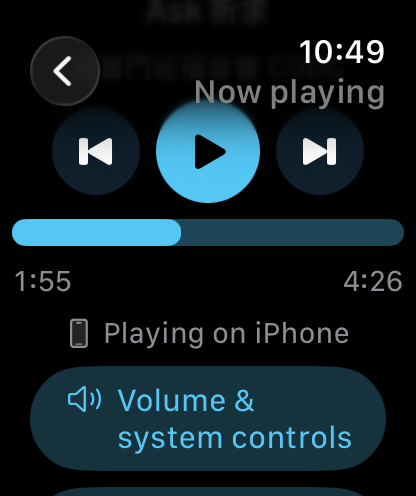

# Apple Watch — genuine 1.7.3 simulator captures

These are unaltered PNGs from Simulator Save Screen, not artwork or constructed device state. The phone and watch were a connected dedicated simulator pair. This verifies the simulator workflow; physical Watch and CarPlay checks remain separate.

## Bible chapter handoff

The phone showed Matthew1 in BSB-Y; Watch received the actual chapter text. Advancing the phone to Matthew2 refreshed Watch to the same chapter without choosing a chapter on Watch.

## Audio and remote pause

The phone played **Ask祈求** from the real song library. Watch received its title, CGDC credit, cover and changing progress. Pressing Watch Pause changed the control to Play. Both phone and Watch independently showed a stopped position of **1:55 /4:26** after the command reply. This was playback through the existing app, not an injected snapshot.

Dimensions, version/source and SHA-256 are in [manifest.json](manifest.json). The paused progress view is QA evidence. Store dimensions and screenshot slots must be checked for their particular destination before upload.
