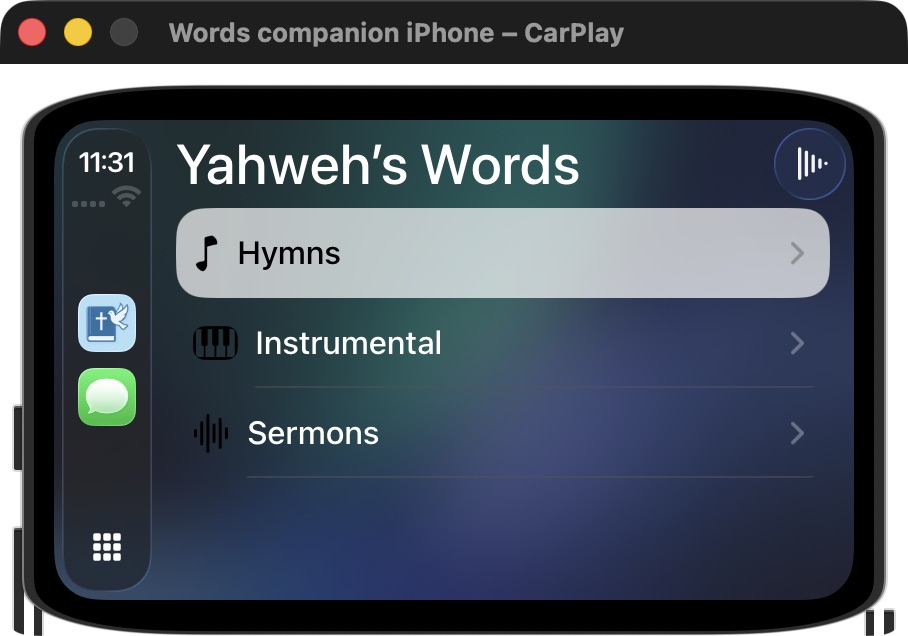
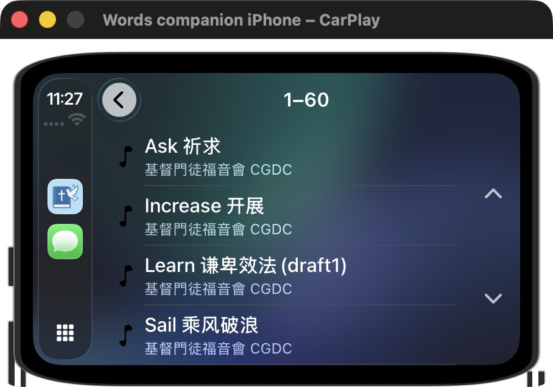
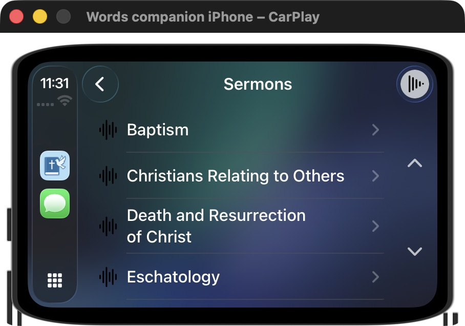
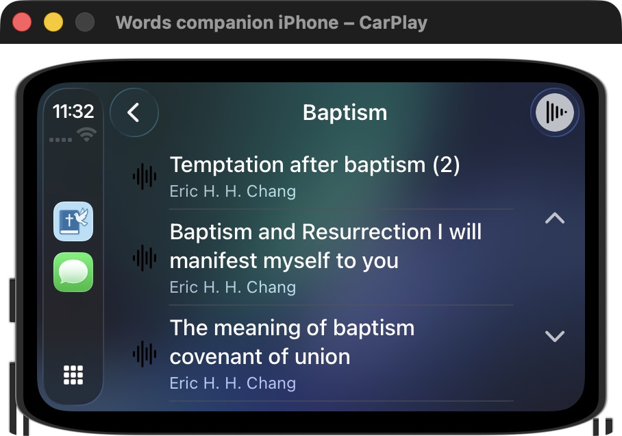

# CarPlay — genuine 1.7.3 simulator catalogue captures

These are unaltered captures of the actual CarPlay simulator window, including its frame. Xcode built the unchanged tagged app source with simulator signing enabled. A manually signed simulator copy had failed launch; the normal Xcode build restored phone launch and CarPlay discovery. This development-environment repair does not change the processed App Store binary.

The Words icon was present in CarPlay. Hymns, Instrumental and Sermons opened their real catalogues. Selecting Ask祈求 produced the same song and advancing playback position on the phone. **Browse audio** returned from the standard Now Playing page directly to the category root.

## Scope and remaining transport check

The simulator's standard Now Playing page received the correct title/artist/duration but continued to display its initial0:00/play icon while the phone advanced. That capture is held from Store marketing. System transport/progress and physical dashboard operation therefore remain open checks; successful catalogue navigation does not close them. Do not invent a live position or claim physical vehicle testing. There is no dedicated CarPlay screenshot slot in the current phone submission workflow used here; these supplemental catalogue screenshots belong in GitHub documentation until a destination requests an appropriate format.

[manifest.json](manifest.json) records measured dimensions and SHA-256.
